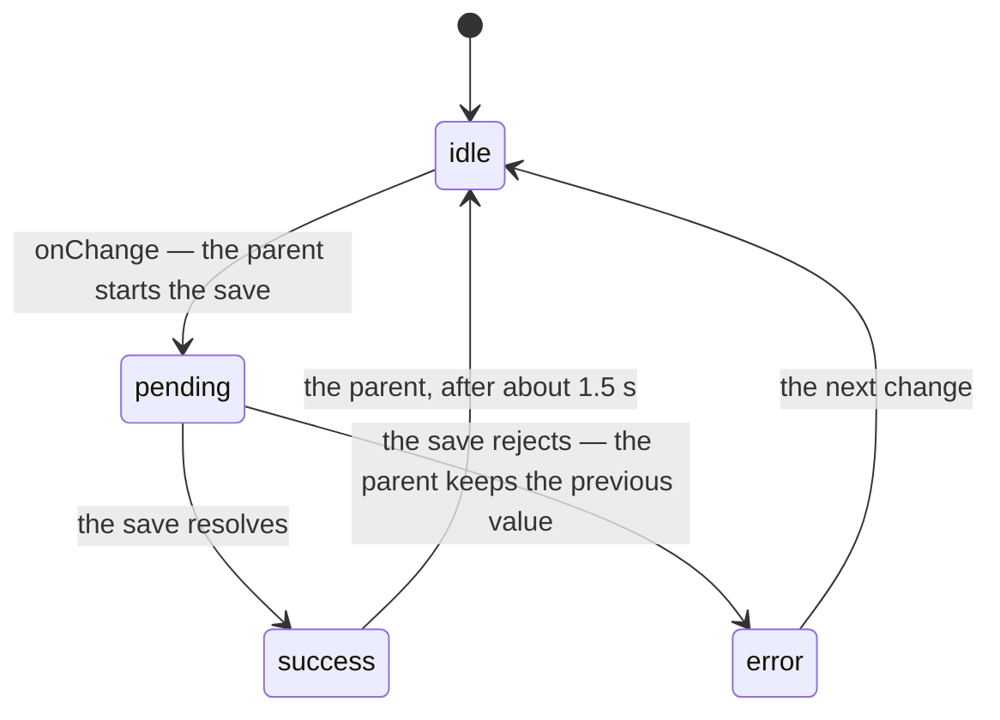

# Saving states

The contract for a control that saves the moment you touch it — a switch, a
segmented control, a select that stores a preference. The control shows how
the save is going; the parent owns everything else.

## The prop

Every such control takes `status`, typed as `SavingStatus` from
`src/lib/saving.ts`:

| `status` | The control | The parent |
|---|---|---|
| `idle` | The everyday look. The default. | Nothing in flight |
| `pending` | A spinner where the state lives, `aria-busy`, and further changes ignored until the save settles | Has set the new value and started the save |
| `success` | A check where the state lives | Returns to `idle` after about 1.5 s — the control never times anything |
| `error` | The critical stroke and `aria-invalid` | Has kept the previous value — the control never reverts anything — and hands the message to `Field` |

## Three rules

1. **Controlled only.** A failed save means the parent never committed the
   new value, so "reverting" is the parent leaving `value` (or `checked`)
   alone. An uncontrolled control has nothing to leave alone.
2. **The parent owns time.** The return from `success` to `idle` is the
   parent's timer. A control that times its own success would drift from the
   parent's idea of the state the moment two saves overlap.
3. **`Field` owns the message.** Wrap the control in a `Field` and pass
   `error`; `Field` renders it as an alert and wires it to the control through
   `aria-describedby`. The control never renders text of its own, the same
   split `Input` uses.

`loading` is the house convention for a busy control and `status="pending"`
covers the same ground. `status` wins for these controls because success and
error need a home too; one prop for the three is easier to guess than two.

## Where the state lives

Each control puts the spinner and the check where its state already is: the
selected segment of a `SegmentedControl`, the knob of a `Toggle`. Both are
decorative — `aria-busy` already says "pending", and success is a moment, not
information to announce. The spinner is Phosphor's `circle-notch`, and it
respects `prefers-reduced-motion` by pulsing instead. The error stroke is
`accent.critical.outline.border.default`, the one `Input` draws when invalid;
the check is `accent.success.tonal.content.default`. No control adds a token
for this.

## The stories, and the tests

Every control with `status` ships the same seven stories: `Pending`, `Success`
and `ErrorState` in both themes, and four `play` stories that run under
`npm test`. Two of those, `SaveSucceeds` and `SaveFails`, wrap the control in
`useFakeSave` from `src/lib/story-saving.ts` — the parent's half of this
contract in one hook, with a save that resolves or rejects after a delay. A
new control's flow stories are that hook around the control and about twenty
lines of assertions.

## Controls that carry it

| Control | Where the state shows | Since |
|---|---|---|
| `SegmentedControl` | The selected segment | #93 |
| `Toggle` | The knob | this PR |

Candidates, in order: `Checkbox` (when it saves on change rather than on
submit), `Select`, `SearchSelect`, `RadioGroup`. Tracked in issue #94.
