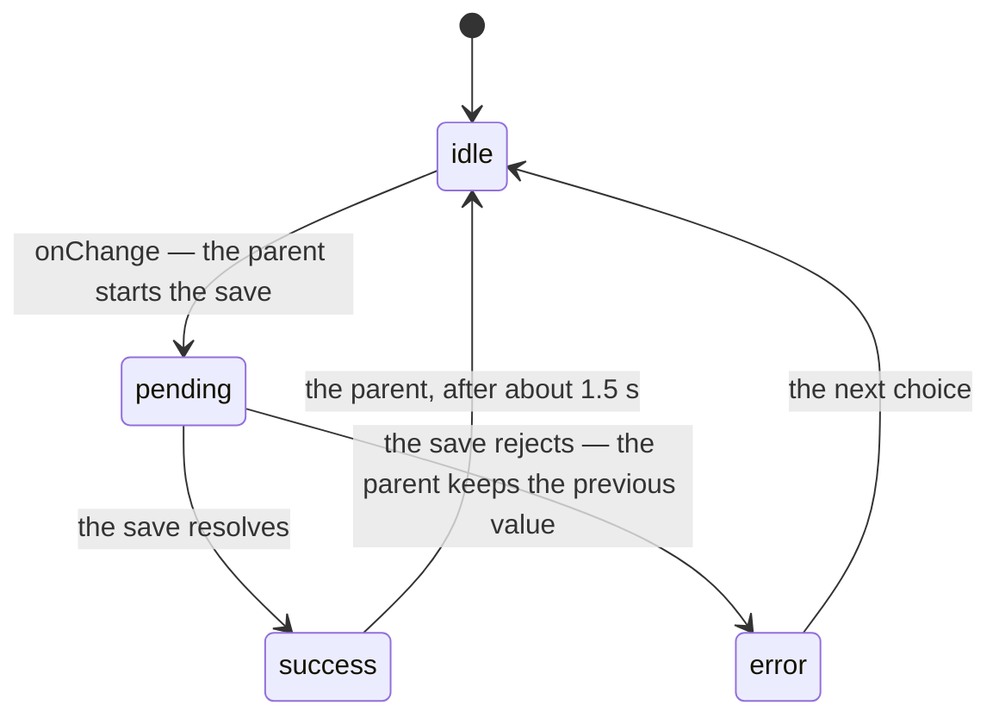

# SegmentedControl

A small set of mutually exclusive options, all visible at once.

## When to use

| Situation | Use | Why |
|---|---|---|
| Switching how the same content is shown (List / Board / Calendar) | **SegmentedControl** | The content doesn't change, only its shape |
| Moving between different content (Overview / Activity / Files) | `Tabs` | Each option owns its own panel |
| Two states, on or off | `Toggle` | A control with two segments is a switch wearing a costume |
| More than five options | `Select` | Labels crowd; the control stops being scannable |
| A filter that can be cleared | `Chip` | A segmented control always has exactly one option chosen |
| Choosing a segment saves something (a default view, a preference) | **SegmentedControl** with `status` | The parent drives `pending → success \| error`; the control shows it — see "Saving a change" |

Two to five options. Every option must be short enough to read at a glance —
if you need more than about two words per segment, the wrong control is being used.

## Props

| Prop | Type | Default | Notes |
|---|---|---|---|
| `options` | `Array<string \| SegmentedControlOption>` | — | A bare string is shorthand for `{ value, label }` |
| `value` | `string` | — | Controlled selection |
| `defaultValue` | `string` | first enabled option | Uncontrolled starting selection |
| `onChange` | `(value: string) => void` | — | Fires on click and on arrow-key movement |
| `size` | `sm \| md` | `md` | `sm` only where a pointer is guaranteed — see Accessibility |
| `fullWidth` | `boolean` | `false` | Stretches to the container; segments share the width evenly |
| `status` | `idle \| pending \| success \| error` | `idle` | Where the save of the current selection stands. Parent-driven; see below |
| `aria-label` | `string` | — | Required unless you pass `aria-labelledby` |

`SegmentedControlOption` is `{ value, label, disabled?, 'aria-label'? }`.
Set `aria-label` on an option whose `label` isn't plain text.

## Tokens

| Part | Token |
|---|---|
| Track | `surface.neutral.subtle`, `radius.md` |
| Selected segment | `surface.elevated`, `text.primary`, `shadow.card`, `radius.sm` |
| Unselected label | `text.tertiary` → `text.primary` on hover |
| Disabled label | `text.disabled` |
| Focus ring | `stroke.focused` at 2px |
| Type | `type.label-md` (`sm`) / `type.label-lg` (`md`) |
| Error stroke | `accent.critical.outline.border.default` — the stroke `Input` draws when invalid |
| Success check | `accent.success.tonal.content.default` |
| Pending label | `text.tertiary` — the selected label mutes to the unselected colour |

No new tokens were added for this component. The pending spinner is the
Phosphor `circle-notch` glyph, added to `Icon`.

## Saving a change

When choosing a segment persists something — a default view, a preference —
the parent drives `status` and the control shows it:

| Status | The control | The parent |
|---|---|---|
| `pending` | Spinner in the selected segment, label muted, group `aria-busy`, further selection ignored | Has set `value` to the new choice and started the save |
| `success` | Check in the selected segment | Returns to `idle` after about 1.5 s — the control never times anything |
| `error` | Critical stroke on the track, `aria-invalid` on the group | Has kept the previous `value` — the control never reverts anything — and passes the message to `Field` |

Three things follow from the parent owning it all:

- **Async use is controlled-only.** A failed save means the parent never
  committed the new value, so "reverting" is the parent leaving `value`
  alone. An uncontrolled control has nothing to leave alone.
- **The message is `Field`'s.** Wrap the control in a `Field` and pass
  `error`; `Field` renders it as an alert and wires it to the group through
  `aria-describedby`. The control never renders text of its own, the same
  split `Input` uses. `Field`'s `label` is a `<label for>`, which does not
  name a radiogroup — give the control `aria-label` and leave `Field`'s label
  off.
- **`loading` is the house convention for a busy control**, and
  `status="pending"` covers the same ground. `status` wins here because
  success and error need a home too; one prop for the three is easier to
  guess than two.

The `SaveSucceeds` and `SaveFails` stories are the whole contract in about
forty lines of parent code, and they run as tests.

## Accessibility

- **Roving tab stop.** The whole control is one stop in the tab order. `←`/`↑` and
  `→`/`↓` move between segments and select as they go; `Home` and `End` jump to the
  ends. Disabled segments are skipped.
- **Target size.** A `md` segment is 40px tall, meeting the 40px minimum. A `sm`
  segment is 32px — use it only where a pointer is guaranteed (dense desktop
  toolbars, table headers), never on a touch surface.
- **The selected segment is carried by more than its background.** The white
  selected surface sits at only **1.1:1** against the track in light theme and
  1.4:1 in dark, so the surface colour alone would not satisfy WCAG 1.4.11. Two
  things make up for it: the label darkens from `text.tertiary` to `text.primary`
  (6.9:1 against the track, 20:1 on the selected surface), and the segment lifts —
  `shadow.card` gives a shape cue that survives a greyscale check. Label weight
  does *not* change: `type.label-lg` carries weight 500 as part of the token, and
  the ramp has no 500/400 pair at 13px, so a weight shift can't be done
  consistently across both sizes without a new token. If you want the selected
  *surface* itself to clear 3:1, that also needs a new token — raise it with the
  design lead rather than reaching for an arbitrary class.
- **Contrast, light / dark:** selected label 20.2:1 / 14.6:1, unselected label
  6.9:1 / 7.0:1, focus ring 5.6:1 / see note below.
- **Dark-theme focus ring is currently below 3:1** (`stroke.focused` was not
  inverted for dark). This affects every component including Button and is tracked
  separately — it is not specific to this control.
- The group is a `radiogroup`; each segment is a `radio` with `aria-checked`.
  Screen readers announce "2 of 3".
- **Saving states.** `pending` sets `aria-busy` on the group; `error` sets
  `aria-invalid`, and `Field`'s message is an alert wired through
  `aria-describedby`. The spinner and the check are decorative: the group's
  state already says "busy", and success is a moment, not information. The
  spinner respects `prefers-reduced-motion` (it pulses instead of spinning).
- **Interaction tests.** `SelectsOnClick`, `KeyboardNavigation`,
  `SaveSucceeds` and `SaveFails` are `play` stories and run under `npm test`.

## Don't

- Don't use it as a tab bar. If choosing an option loads different content, that's `Tabs`.
- Don't ship it without `aria-label` — "radio group" with no name is what a screen reader will say.
- Don't allow zero selected. There is always exactly one.
- Don't put more than five segments in it, and don't let a label wrap.
- Don't hardcode colours or spacing. `className="bg-[#f1f5f9]"` is a bug — add a token instead.
- Don't use `status` on an uncontrolled control. There is no `value` for the parent to keep on error.
- Don't time the return from `success` inside anything but the parent, and don't revert `value` anywhere but the parent.
- Don't render an error message next to the control yourself — that is `Field`'s job, and it is what wires `aria-describedby`.
